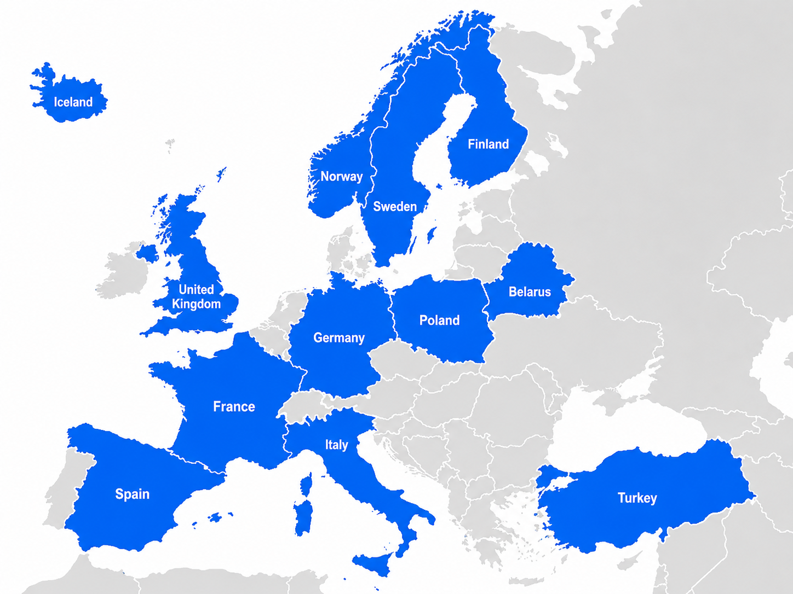

# 🌍 Image Geolocation Challenge: Where in Europe was this photo taken?
You get street-level photos from **12 European
countries**. Your model predicts the **GPS coordinate** (latitude, longitude)
each photo was taken at. The closer your guess, the better your score.


---

## TL;DR

- **Input:** a 512×512 street-level photo.
- **Output:** predicted `lat, lng` in decimal degrees.
- **Score:** median **haversine distance** (km) to the truth, over a hidden test
  set. **Lower is better.**
- **Two rules:** your submitted model has **≤ 5,000,000 parameters**, and you
  train **only on the data we provide** (no external or generated data).
- **You submit:** a `.zip` with your code (training script, model, evaluation
  script, `predictions.csv`, `requirements.txt`, `README.md`) and a 1 to 2 page
  LaTeX writeup.

---

## The data

```
geo_dataset/
├── train/                # ~11,000 labelled training images
├── train_labels.csv      # labels for train/  (your supervision)
└── holdout_public/       # 2,400 UNLABELLED test images  -> you predict these
```

**`train_labels.csv`** has one row per training image: `filename, country, iso,
lat, lng`. The **regression target is `(lat, lng)`**; `country`/`iso` are extra
metadata you may use or ignore. Your final submission predicts coordinates.

**The 12 countries:** Belarus, Finland, France, Germany, Iceland, Italy, Norway,
Poland, Spain, Sweden, Turkey, United Kingdom. All test images come from these.



The test labels are private and used only to score your `predictions.csv`.

---

## The rules

Two constraints, and anything that respects them is fair game:

1. Your **submitted model must have ≤ 5,000,000 parameters.**
2. **Train only on the data we give you.** No external datasets, no scraped or
   downloaded images, and no synthetic or generated data. 

If you're unsure whether something is allowed, send us an email.

---

## Scoring

For each test image we take the **haversine distance** (km) between your
predicted coordinate and the truth. Your headline score is the **median** over
all 2,400 images; **mean** is the tie-break. We also report `< 200 km` (got the
city) and `< 750 km` (got the country) rates.

```python
import numpy as np

def haversine_km(lat1, lng1, lat2, lng2, R=6371.0088):
    lat1, lng1, lat2, lng2 = map(np.radians, (lat1, lng1, lat2, lng2))
    d = (np.sin((lat2 - lat1) / 2) ** 2
         + np.cos(lat1) * np.cos(lat2) * np.sin((lng2 - lng1) / 2) ** 2)
    return 2 * R * np.arcsin(np.sqrt(np.clip(d, 0, 1)))
```

You don't have the test labels, so hold out part of `train_labels.csv` as your own
validation set to validate your method.

---

## What to submit

Submit a single `.zip` containing two things: your code and a writeup.

**1. The code.** Everything needed to reproduce your result:

- Your training script(s).
- Your evaluation script(s), including whatever generated `predictions.csv`.
- Your trained model file (weights).
- `predictions.csv` for the holdout test set.
- A `requirements.txt` pinning the packages you used.
- A `README.md` explaining how to set up the environment and run your code (the
  exact commands to install dependencies, train, and produce predictions), plus
  your final parameter count and how long the final training run takes.

**2. The writeup.** A 1 to 2 page report, written in LaTeX, on what you tried.
Focus on the experiments themselves: the things you tried (including the ones
that failed), what worked, what didn't, and why. We read a lot of these, so skip
the long intro and the problem restatement; a short, honest list of experiments
is worth far more than a polished background section. You are encouraged to use
images, plots, and creative solutions; explaining the reasoning behind them may
earn extra marks. But please still use appropriate references if you take inspiration from prior work.

### `predictions.csv` exact format

- Header, exactly: `filename,pred_lat,pred_lng`
- One row per image in `holdout_public/`: all **2,400**, no more, no fewer.
- `filename` includes `.jpg`; `pred_lat`, `pred_lng` in decimal degrees. UTF-8, comma-separated, no index column.

```csv
filename,pred_lat,pred_lng
9f8e7d6c5b4a39281706.jpg,48.8566,2.3522
1a2b3c4d5e6f70819203.jpg,59.3293,18.0686
```


---

## Grading

**50%** method & code quality · **35%** writeup (the reasoning behind your
choices) · **15%** leaderboard. A clever, well-argued idea that slightly
underperforms beats a tuned copy of a tutorial.

Good luck, and have fun. 🗺️
